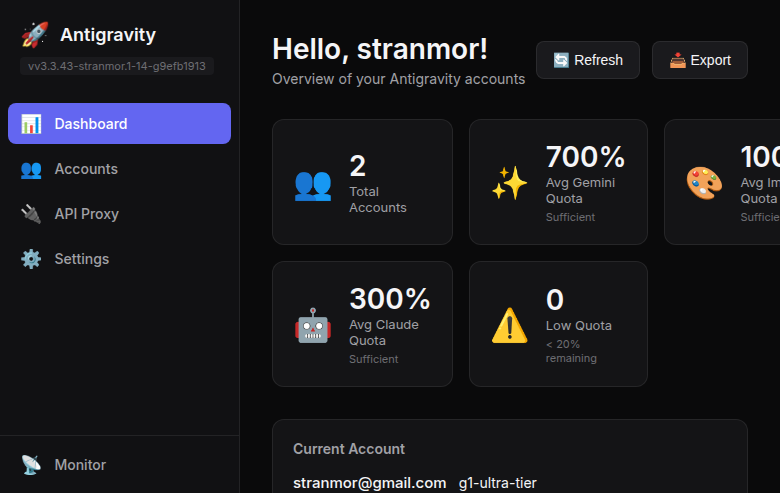
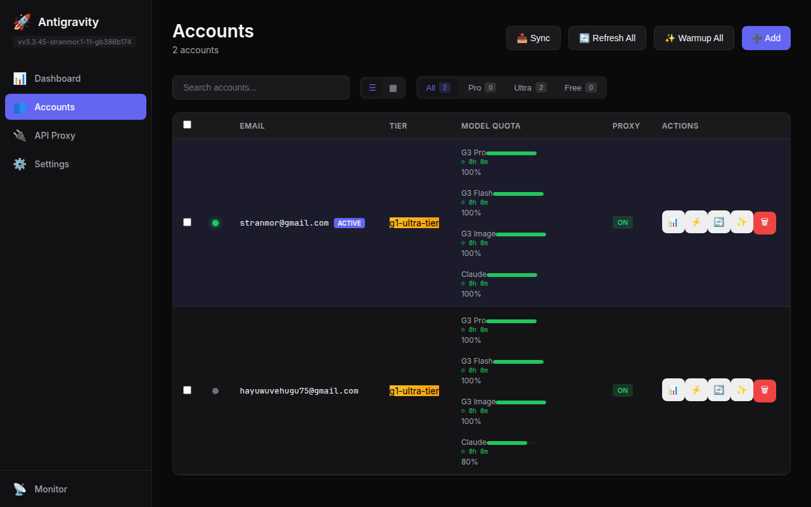

<div align="center">

# Antigravity Server

### 🚀 **Pure Rust** AI Gateway: Headless, Resilient, High-Performance


[](https://github.com/lbjlaq/Antigravity-Manager)
[](https://www.rust-lang.org/)
[](https://leptos.dev/)
[](https://github.com/tokio-rs/axum)
[](LICENSE)

**English** | [Русский](README_RU.md) | [Upstream 中文](https://github.com/lbjlaq/Antigravity-Manager)

---

**Antigravity Server** is a high-performance AI gateway that transforms Google and Anthropic web sessions into standardized, OpenAI-compatible APIs. 

Built from the ground up for **headless server deployment** and **maximum resilience**, it's a complete architectural reimagining of the original [Antigravity Manager](https://github.com/lbjlaq/Antigravity-Manager) — not just a fork, but a production-ready server designed for VPS and Docker environments.

</div>

---

## 📸 Screenshots

<div align="center">

| Dashboard | Account Management |
|:---------:|:------------------:|
|  |  |
| Real-time quota monitoring across all accounts | Per-model quota tracking with tier classification |

</div>

---

## 🎯 Why Antigravity Server?

While [Antigravity Manager](https://github.com/lbjlaq/Antigravity-Manager) provides an excellent desktop experience, Antigravity Server is built for developers who need a **headless daemon** that can run on a VPS, in Docker, or as a background service with enterprise-grade stability.

### Key Differentiators

| Feature | Antigravity Manager | Antigravity Server |
|---------|---------------------|-------------------|
| **Primary Target** | Desktop (Tauri + GUI) | **Headless Server (Axum Daemon)** |
| **Frontend** | React + TypeScript | **Leptos (Pure Rust → WASM)** |
| **Architecture** | Monolithic | **Modular Crate Workspace** |
| **Automation** | Frontend Polling (Open UI) | **Native Async Schedulers (Daemon)** |
| **Persistence** | Direct File I/O | **Sequential Actor Loop (Race-free)** |
| **Rate Limiting** | Reactive (Retry on 429) | **AIMD Predictive Algorithm** |
| **Reliability** | Basic Failover | **Circuit Breakers + Health Scores** |
| **Routing** | Silent Model Substitution | **Strict Routing + Preferred Account** |
| **Isolation** | Shared IP | **WARP Proxy Support (Per-Account IP)** |
| **Observability**| Local UI | **Resilience API & Prometheus Metrics** |
| **Security** | Standard String Compare | **Constant-time Auth (Timing Safe)** |
| **Performance** | Standard | **LRU Schema Caching** |
| **Audio in Chat** | ❌ Not implemented | **✅ Official `input_audio` format** |
| **Video in Chat** | ❌ Not supported | **✅ Via `video_url` extension** |

---

## ✨ Killer Features

### 🖥️ Headless Server (Killer Feature #1)
No X server, no GUI required. Deploy `antigravity-server` as a lightweight daemon on any Linux VPS. It comes with a built-in Leptos-based Web UI for remote management.

### 📊 AIMD Predictive Rate Limiting (Killer Feature #2)
Using the **Additive Increase / Multiplicative Decrease** algorithm (similar to TCP congestion control), the gateway learns the optimal request rate for each account. It predicts quota exhaustion *before* it happens, ensuring zero wasted requests and smoother failover.

### 🔄 Integrated Background Schedulers
The server operates fully autonomously with a dedicated `Scheduler` system (ported and enhanced from upstream logic). Independent async tasks handle:
- **Auto Quota Refresh**: Automatically updates account capabilities and quotas as they reset, without manual intervention.
- **Active Warmup**: Periodic background requests keep sessions alive and validate cookie integrity, ensuring accounts are ready when needed.
- **Non-blocking Persistence**: Chat history and state are saved asynchronously, ensuring the main request loop handles traffic with zero I/O jitter.
- **Self-Healing**: Periodic health checks monitor and reset circuit breakers.

### 🛡️ Circuit Breakers & Resilience
Each account is protected by an independent circuit breaker and a dynamic **Health Score**. If an account starts failing, it's automatically isolated to prevent cascading failures. Monitor everything via the **Resilience API**:
- `GET /api/resilience/health` — Real-time account availability.
- `GET /api/resilience/circuits` — Circuit breaker states.
- `GET /api/resilience/aimd` — Rate limiting telemetry.
- `GET /api/metrics` — Prometheus-compatible metrics.

### 🌐 WARP Proxy Support
Avoid account correlation by assigning unique IPs to each account via Cloudflare WARP. Perfect for maintaining high reputation scores and avoiding broad IP-based rate limits.

---

## 🔌 Universal Protocol Adapter

Connect any OpenAI-compatible tool to Claude and Gemini:

```
┌─────────────────┐     ┌─────────────────────┐     ┌──────────────────┐
│   Claude Code   │     │                     │     │  Google Gemini   │
│   OpenAI SDK    │ ──▶ │  Antigravity Proxy  │ ──▶ │  Anthropic API   │
│   Cursor / IDE  │     │   (localhost:8045)  │     │  (via OAuth)     │
│   Custom Bots   │     │                     │     │                  │
└─────────────────┘     └─────────────────────┘     └──────────────────┘
```

- **Standardized API**: Implements `/v1/chat/completions` and `/v1/messages`.
- **Dynamic Discovery**: Supports `/v1/models` for seamless integration with IDEs.
- **Image Support**: Imagen 3 via OpenAI DALL-E interface compatibility.
- **Enhanced Tooling**: Includes correct JSON schema alignment for function calling (fixing upstream quirks).

---

## 🎵 Multimodal Support

Full support for audio and video inputs using official OpenAI API format:

### Audio Input (Official OpenAI Format)

```python
import openai
import base64

client = openai.OpenAI(
    api_key="sk-antigravity",
    base_url="http://127.0.0.1:8045/v1"
)

# Read and encode audio file
with open("audio.wav", "rb") as f:
    audio_b64 = base64.b64encode(f.read()).decode()

response = client.chat.completions.create(
    model="gemini-3-pro",
    messages=[{
        "role": "user",
        "content": [
            {"type": "text", "text": "What is being said in this audio?"},
            {"type": "input_audio", "input_audio": {"data": audio_b64, "format": "wav"}}
        ]
    }]
)
```

**Supported formats:** `wav`, `mp3`, `ogg`, `flac`, `m4a`

### Video Input (Gemini Extension)

```python
# Read and encode video file
with open("video.mp4", "rb") as f:
    video_b64 = base64.b64encode(f.read()).decode()

response = client.chat.completions.create(
    model="gemini-3-pro",
    messages=[{
        "role": "user",
        "content": [
            {"type": "text", "text": "Describe what happens in this video"},
            {"type": "video_url", "video_url": {"url": f"data:video/mp4;base64,{video_b64}"}}
        ]
    }]
)
```

**Supported formats:** `mp4`, `mov`, `webm`, `avi`

### Audio Transcription (Whisper-compatible)

```bash
curl -X POST http://127.0.0.1:8045/v1/audio/transcriptions \
  -H "Authorization: Bearer sk-antigravity" \
  -F "file=@audio.mp3" \
  -F "model=whisper-1"
```

> **Note:** `video_url` is our extension — OpenAI doesn't support video in chat completions, but Gemini does.

---

## 🚀 Installation

### Using Nix (Recommended)

The easiest way to build and run the server with all dependencies pinned:

```bash
git clone https://github.com/Stranmor/Antigravity-Server.git
cd Antigravity-Manager

# Build and run the headless server
nix run .#build-server
./target/release/antigravity-server
```

### Manual Build

Requires Rust toolchain and [Trunk](https://trunkrs.dev/) for the frontend:

```bash
# Build the server (automatically builds the Leptos UI via build.rs)
cargo build --release -p antigravity-server

# Run
./target/release/antigravity-server
```

---

## ⚡ Quick Start

### Claude Code CLI
```bash
export ANTHROPIC_API_KEY="sk-antigravity"
export ANTHROPIC_BASE_URL="http://127.0.0.1:8045"
claude
# Now supports efficient JSON schema caching for faster tool interactions
```

### Python (OpenAI SDK)
```python
import openai

client = openai.OpenAI(
    api_key="sk-antigravity",
    base_url="http://127.0.0.1:8045/v1"
)

response = client.chat.completions.create(
    model="gemini-3-pro-high", # Automatically routed to best account
    messages=[{"role": "user", "content": "Hello!"}]
)
```

### cURL
```bash
curl http://127.0.0.1:8045/v1/chat/completions \
  -H "Authorization: Bearer sk-antigravity" \
  -H "Content-Type: application/json" \
  -d '{"model": "gemini-3-flash", "messages": [{"role": "user", "content": "Hi"}]}'
```

---

## 🔧 Deployment

### Systemd Service (Linux VPS)
Create `~/.config/systemd/user/antigravity.service`:

```ini
[Unit]
Description=Antigravity AI Gateway
After=network.target

[Service]
ExecStart=%h/.cargo/bin/antigravity-server
Restart=always
Environment=RUST_LOG=info
Environment=ANTIGRAVITY_PORT=8045

[Install]
WantedBy=default.target
```

```bash
systemctl --user enable --now antigravity
```

### Environment Variables
| Variable | Default | Description |
|----------|---------|-------------|
| `ANTIGRAVITY_PORT` | `8045` | Port the gateway listens on |
| `ANTIGRAVITY_DATA_DIR` | `~/.antigravity_tools` | Path for accounts and configuration |
| `RUST_LOG` | `info` | Logging verbosity (debug, info, warn) |

---

## 🖥️ CLI Management

Full headless control without Web UI. Perfect for scripts, automation, and remote management.

```bash
antigravity-server [OPTIONS] [COMMAND]
```

### Commands

| Command | Description |
|---------|-------------|
| `serve` | Start the proxy server (default if no command) |
| `account list` | List all accounts with quota status |
| `account add --file <path>` | Add account from JSON file |
| `account add --token <json>` | Add account from inline JSON |
| `account remove <email>` | Remove an account |
| `account toggle <email> --enable/--disable` | Enable or disable account |
| `account refresh <email\|all>` | Refresh quota for account(s) |
| `config show` | Show current configuration |
| `config get <key>` | Get specific config value |
| `config set <key> <value>` | Set configuration value |
| `warmup --all` | Warmup all accounts |
| `warmup <email>` | Warmup specific account |
| `status` | Show proxy status and statistics |
| `generate-key` | Generate new API key |

### Examples

```bash
# List accounts with quota percentages
antigravity-server account list
┌──────────────────────────┬──────────────┬────────┬────────┬────────┐
│ Email                    ┆ Name         ┆ Gemini ┆ Claude ┆ Status │
╞══════════════════════════╪══════════════╪════════╪════════╪════════╡
│ user@gmail.com           ┆ John Doe     ┆ 100%   ┆ 80%    ┆ Active │
└──────────────────────────┴──────────────┴────────┴────────┴────────┘

# Add account from file
antigravity-server account add --file ~/.antigravity_tools/accounts/new.json

# Check proxy status
antigravity-server status

# JSON output for scripting
antigravity-server account list --json
antigravity-server config show --json
```

### Global Options

| Option | Environment | Default | Description |
|--------|-------------|---------|-------------|
| `-p, --port` | `ANTIGRAVITY_PORT` | `8045` | Server port |
| `-l, --log-level` | `RUST_LOG` | `info` | Log verbosity |

---

## 📦 Project Structure

```
crates/
├── antigravity-types/      # Foundation types & error hierarchy
├── antigravity-shared/     # Re-export layer for external crates
├── antigravity-core/       # Business logic (Proxy, AIMD, Circuits)
└── antigravity-server/     # Axum HTTP Entry Point

src-leptos/                 # Pure Rust WASM Frontend
vendor/antigravity-upstream/ # Upstream reference (Git Submodule)
```

---

## 🔀 Upstream Sync Strategy

This fork uses **Semantic Porting** — we don't blindly copy upstream changes. Instead, we:

- ✅ **Always Port**: Bug fixes, new model support, security patches, JSON schema improvements, background logic (like `BackgroundTaskRunner` behavior).
- ❌ **Never Port**: React/Tauri code (we use Leptos/Axum), changes conflicting with our resilience layer

**🔄 Active Sync**: We actively port useful upstream changes. Currently synced with **v4.0.4**, plus our exclusive additions: 

- **Reliability**: AIMD predictive rate limiting, Circuit Breakers, sticky session rebind on 429.
- **Persistence**: Sequential actor-based file writing to eliminate race conditions.
- **Security**: Hardened constant-time auth, WARP proxy isolation.
- **Features**: Multimodal audio/video support, LRU schema caching, `preferred_account_id` routing, aspect ratio support, robust token rotation, and auto-refresh schedulers.

See [AGENTS.md](AGENTS.md) for detailed architecture documentation and sync workflow.

---

## 📄 License & Attribution

This project is based on [lbjlaq/Antigravity-Manager](https://github.com/lbjlaq/Antigravity-Manager). Full credit to the original authors for the core proxy concept. Antigravity Server is a complete architectural reimagining focused on headless deployment and resilience.

**License**: [CC BY-NC-SA 4.0](LICENSE) — Non-commercial use only.

---

<div align="center">

**Built with ❤️ in 100% Rust**

[](https://github.com/Stranmor/Antigravity-Server)

</div>
