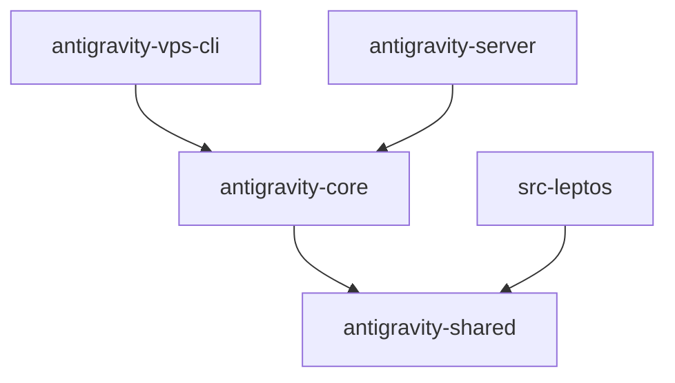

<div align="center">

# Antigravity Manager — Stranmor Fork

### 🚀 **Pure Rust** AI Gateway with Headless Server & Leptos UI


[](https://github.com/Stranmor/Antigravity-Manager/releases)
[](https://www.rust-lang.org/)
[](https://leptos.dev/)
[](https://github.com/tokio-rs/axum)
[](LICENSE)

**English** | [Upstream 中文](https://github.com/lbjlaq/Antigravity-Manager)

---

**Enterprise-grade local AI proxy** that transforms Google/Anthropic Web Sessions into standardized OpenAI-compatible APIs.  
Deploy anywhere: Desktop (Tauri) • Headless Server (VPS) • Edge

</div>

---

## 🎯 Why This Fork?

This fork extends the excellent [lbjlaq/Antigravity-Manager](https://github.com/lbjlaq/Antigravity-Manager) with **production-hardened architecture** and **headless deployment capabilities**:

| Feature | Upstream | This Fork |
|---------|----------|-----------|
| **Frontend** | React + TypeScript | **Leptos (Pure Rust → WASM)** |
| **Headless Server** | ❌ Desktop-only | ✅ **`antigravity-server`** daemon |
| **Architecture** | Monolith | **Modular Crate Workspace** |
| **Rate Limiting** | Reactive retry | **AIMD Predictive Algorithm** |
| **Model Fallback** | Silent substitution | **Strict Routing (No Fallback)** |
| **VPS CLI** | ❌ | ✅ **`antigravity-vps-cli`** |
| **Code Reuse** | Tauri-coupled | **`antigravity-core`** library |

---

## ✨ Key Features

### 🔌 Universal Protocol Adapter
Transform any AI client into a unified gateway:

```
┌─────────────────┐     ┌─────────────────────┐     ┌──────────────────┐
│   Claude Code   │     │                     │     │  Google Gemini   │
│   OpenAI SDK    │ ──▶ │  Antigravity Proxy  │ ──▶ │  Anthropic API   │
│   Kilo Code     │     │   (localhost:8045)  │     │  (via OAuth)     │
│   Any Client    │     │                     │     │                  │
└─────────────────┘     └─────────────────────┘     └──────────────────┘
```

- **`/v1/chat/completions`** — OpenAI-compatible (works with 99% of AI tools)
- **`/v1/messages`** — Native Anthropic/Claude protocol
- **`/v1/models`** — Dynamic model discovery
- **`/v1/images/generations`** — Imagen 3 via OpenAI DALL-E interface

### 🧠 Intelligent Account Management
- **OAuth 2.0 Authorization** — One-click Google/Anthropic account linking
- **Smart Rotation** — Automatic failover on 429/401/403 errors
- **Quota Monitoring** — Real-time usage tracking per account
- **Tiered Routing** — Priority dispatch based on subscription tier (Ultra > Pro > Free)

### 📊 AIMD Predictive Rate Limiting
Proactive rate limit avoidance using **Additive Increase / Multiplicative Decrease** algorithm:
- Learns optimal request rates per account
- Predicts quota exhaustion before hitting limits  
- Zero wasted requests on already-exhausted accounts

### 🎯 Strict Model Routing (No Fallback)
**Anti-pattern eliminated**: Unknown models return explicit errors instead of silently falling back.
- Prevents unexpected token consumption
- Guarantees model isolation
- Full transparency in model mapping

---

## 📦 Architecture

```
antigravity-manager/
├── crates/
│   ├── antigravity-core/      # 🧩 Shared business logic
│   │   ├── proxy/             #    Protocol handlers, mappers, routing
│   │   ├── modules/           #    Account, OAuth, quota management
│   │   └── models/            #    Domain types, validation
│   └── antigravity-shared/    # 📋 Common types & DTOs
│
├── antigravity-server/        # 🖥️ Headless daemon (PRODUCTION TARGET)
├── antigravity-vps-cli/       # 🔧 Remote management CLI
├── src-leptos/                # 🌐 Leptos WASM UI (browser)
└── src-tauri/                 # 📚 Upstream reference (read-only)
```

### Crate Dependency Graph


---

## 🚀 Installation

### Option A: Headless Server (Recommended)

```bash
# Clone & build
git clone https://github.com/Stranmor/Antigravity-Manager.git
cd Antigravity-Manager

# Build frontend + server
nix run .#build-server

# Or enter dev shell and run
# nix develop
# build-server

# Run daemon
./target/release/antigravity-server
# → API: http://localhost:8045/v1
# → WebUI: http://localhost:8045
```

### Option B: Development Mode

```bash
# Prerequisites: Nix (highly recommended) or Rust + Trunk
nix run .#run-server
```

### Option C: Homebrew (macOS/Linux)

```bash
brew tap lbjlaq/antigravity-manager
brew install --cask antigravity-tools
```

---

## ⚡ Quick Start

### Claude Code CLI
```bash
export ANTHROPIC_API_KEY="sk-antigravity"
export ANTHROPIC_BASE_URL="http://127.0.0.1:8045"
claude
```

### Python (OpenAI SDK)
```python
import openai

client = openai.OpenAI(
    api_key="sk-antigravity",
    base_url="http://127.0.0.1:8045/v1"
)

response = client.chat.completions.create(
    model="gemini-2.5-pro",
    messages=[{"role": "user", "content": "Hello!"}]
)
print(response.choices[0].message.content)
```

### cURL
```bash
curl http://127.0.0.1:8045/v1/chat/completions \
  -H "Authorization: Bearer sk-antigravity" \
  -H "Content-Type: application/json" \
  -d '{
    "model": "gemini-2.5-flash",
    "messages": [{"role": "user", "content": "Explain quantum computing"}],
    "stream": true
  }'
```

---

## 🔧 Configuration

### Environment Variables
| Variable | Default | Description |
|----------|---------|-------------|
| `ANTIGRAVITY_PORT` | `8045` | HTTP server port |
| `ANTIGRAVITY_DATA_DIR` | `~/.antigravity` | Database & logs location |
| `RUST_LOG` | `info` | Log level (trace, debug, info, warn, error) |

### Systemd Service (Linux)
```ini
# ~/.config/systemd/user/antigravity.service
[Unit]
Description=Antigravity AI Gateway
After=network.target

[Service]
ExecStart=%h/.cargo/bin/antigravity-server
Restart=always
Environment=RUST_LOG=info

[Install]
WantedBy=default.target
```

```bash
systemctl --user enable --now antigravity
```

---

## 📸 Screenshots

> **Leptos UI** — Our Pure Rust WASM frontend

| Dashboard | Accounts |
|-----------|----------|
|  |  |

| API Proxy | Request Monitor |
|-----------|-----------------|
|  |  |

---

## 🛠️ Development

### Setup Git Hooks
```bash
# First-time setup (enables cargo fmt & clippy checks on commit)
./scripts/install-hooks.sh
```

The pre-commit hook enforces:
- **`cargo fmt --check`** — Code formatting
- **`cargo clippy -- -D warnings`** — Zero warnings policy

---

## 🔗 Upstream

This project is a fork of [lbjlaq/Antigravity-Manager](https://github.com/lbjlaq/Antigravity-Manager). Full credit to the original authors for the core concept and initial implementation.

**What we contribute back:**
- Bug fixes and stability improvements
- Documentation enhancements
- Test coverage

---

## 📄 License

**CC BY-NC-SA 4.0** — Non-commercial use only. See [LICENSE](LICENSE) for details.

---

<div align="center">

**Built with ❤️ in Rust**

[](https://github.com/Stranmor/Antigravity-Manager)

</div>